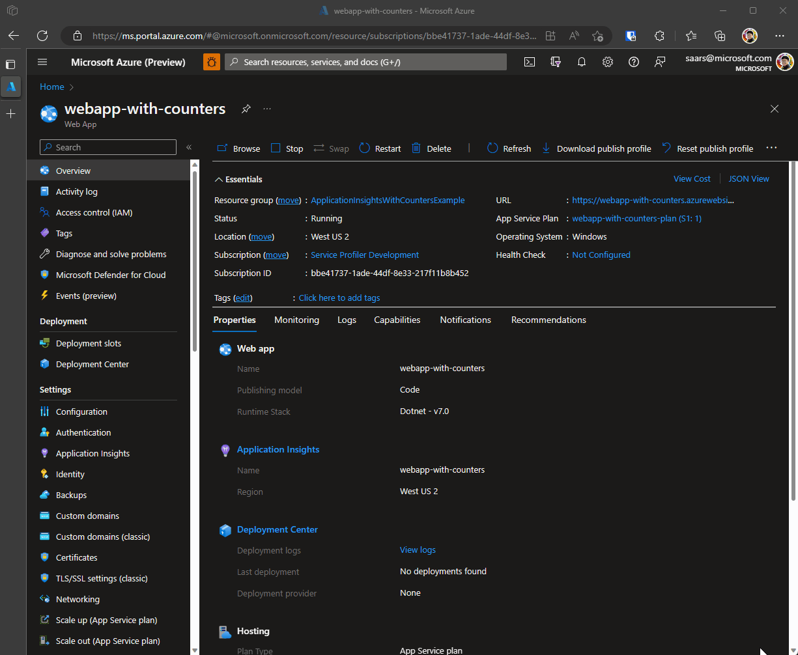

# Build an application with thread pool thread metrics enabled in application insights

## Steps

1. Add application insights SDK if you haven't already (different package for workers):

    ```xml
        <PackageReference Include="Microsoft.ApplicationInsights.AspNetCore" Version="2.21.0" />
    ```

1. Enable Application insights with metrics you want

    ```csharp
    builder.Services.ConfigureTelemetryModule<EventCounterCollectionModule>((module, _) =>
    {
        // This removes all default counters, if any.
        module.Counters.Clear();

        // This adds the system counter "gen-0-size" from "System.Runtime"
        module.Counters.Add(new EventCounterCollectionRequest("System.Runtime", "threadpool-queue-length"));
        module.Counters.Add(new EventCounterCollectionRequest("System.Runtime", "threadpool-thread-count"));
    });
    builder.Services.AddApplicationInsightsTelemetry();
    ```

    Notes, find more well-known counters here: <https://learn.microsoft.com/en-us/dotnet/core/diagnostics/available-counters>

1. Making sure the application insights instrumentation key / connection string is properly set up.

    Notice: Do NOT follow this example, the connection string is NOT well protected and it is not best practice.

1. Deploy your application

1. Check the metrics after it runs for a while (Usually, in a couple of minutes)

    